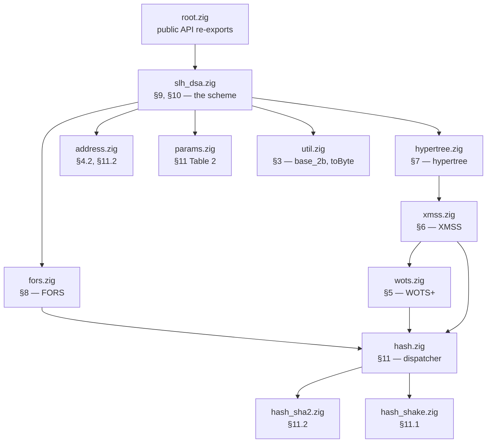

# Components

The same scheme as [How it works](../concepts/index.md), but organised as code:
every FIPS 205 algorithm mapped to the function that implements it.

These pages assume you have read the concept chapters, or already know
SPHINCS+. They explain *this implementation's* choices — buffer strategy,
constant-time notes, where the traps are — rather than re-deriving the design.

## Module layout

The layering rule is strict and one-directional: **nothing in `wots.zig` knows
about XMSS; nothing in `xmss.zig` knows about the hypertree; nothing in
`fors.zig` knows about the top-level scheme.** `address.zig` and the hash
adapter are the only cross-cutting modules.

## Pages

-   **[Parameter sets](parameters.md)** — `src/params.zig`

    ---

    All twelve sets, and the comptime assertions that catch a mistranscribed
    Table 2.

-   **[Addresses (ADRS)](adrs.md)** — `src/address.zig`

    ---

    The 22-byte compressed encoding, and the 22-versus-32-byte trap that
    silently breaks SHAKE interoperability.

-   **[The hash interface](hashing.md)** — `src/hash*.zig`

    ---

    Six functions, two families, one comptime dispatcher. SHAKE is a sponge
    squeeze; SHA-2 needs HMAC and MGF1.

-   **[WOTS+](wots.md)** — `src/wots.zig`

    ---

    §5 Algorithms 5–8.

-   **[XMSS](xmss.md)** — `src/xmss.zig`

    ---

    §6 Algorithms 9–11.

-   **[Hypertree](hypertree.md)** — `src/hypertree.zig`

    ---

    §7 Algorithms 12–13.

-   **[FORS](fors.md)** — `src/fors.zig`

    ---

    §8 Algorithms 14–17.

-   **[The top-level scheme](scheme.md)** — `src/slh_dsa.zig`, `src/prehash.zig`

    ---

    §9 and §10: key generation, signing, verification, digest parsing, and all
    three signature interfaces — internal, context-string, and pre-hash.

## Conventions across every module

**Every module is a generic over `Params`.** `Wots(p)`, `Xmss(p)`, `Fors(p)` and
so on return a namespace with all sizes fixed at compile time. See
[comptime parameterisation](../implementation/comptime.md).

**No allocation anywhere in the library.** Every buffer is a comptime-sized stack
array. The library never takes an allocator, because it never needs one — tree
computations use fixed-height explicit stacks whose depth is a compile-time
constant.

**Output parameters, not return values.** Functions take `out: *[n]u8` rather
than returning arrays. This keeps large signature buffers from being copied and
makes the caller's ownership explicit.

**`pkFromSig`, not `verify`.** WOTS+, XMSS and FORS all *reconstruct* a public
key and hand it back rather than returning a boolean. Only
[the top level](scheme.md) and [`ht_verify`](hypertree.md) compare anything. This
is what makes the layers composable — see
[chapter 4](../concepts/xmss.md#xmss_pkfromsig-verification-by-reconstruction).

**Tests live beside the code.** Each module ends in `test "..."` blocks. `tests/`
holds only KAT and fuzz infrastructure. See
[how this is tested](../implementation/testing.md).
