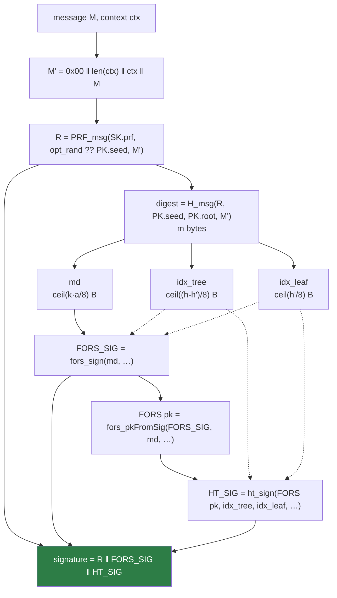
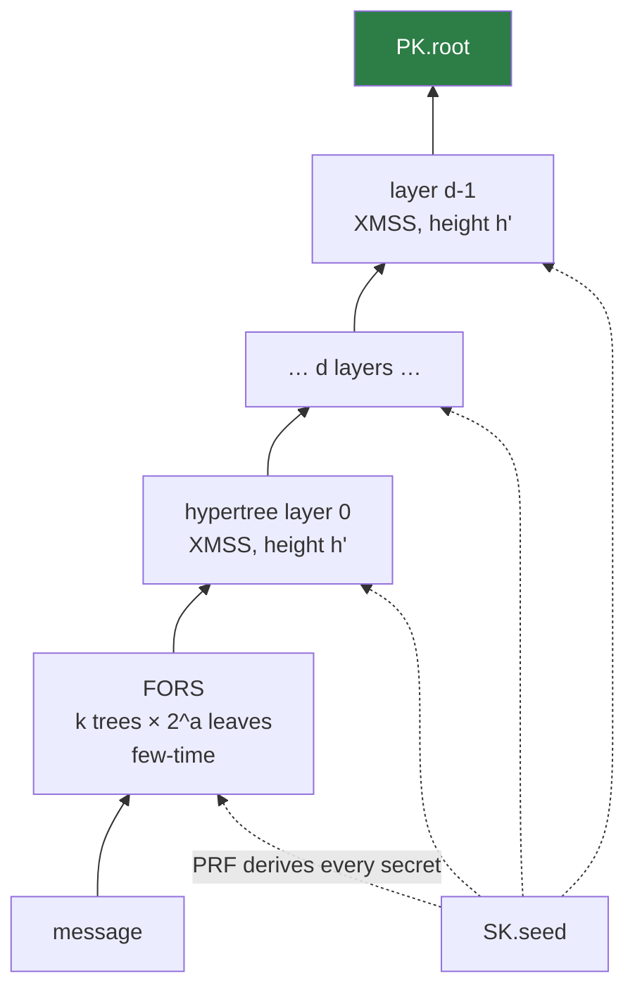

# 8. Putting it together

!!! abstract "Where we are"

    Every component is built. This chapter assembles them into FIPS 205's three
    operations and accounts for every byte.

## Key generation

FIPS 205 §10.1 (`slh_keygen`) draws three `n`-byte values from an approved RBG,
then calls §9.1 Algorithm 18 (`slh_keygen_internal`):

```
SK.seed  ← random    # derives every WOTS+ and FORS secret in the structure
SK.prf   ← random    # keys the message randomiser
PK.seed  ← random    # public; tweaks every hash in this keypair
PK.root  ← root of the top-layer XMSS tree (layer d-1, tree 0)
```

Layout:

```
SK = SK.seed ‖ SK.prf ‖ PK.seed ‖ PK.root       (4n bytes)
PK =                    PK.seed ‖ PK.root       (2n bytes)
```

Two things worth noticing. The private key **contains** the public key, so the
public key can always be recovered from it. And the entire structure — billions
of one-time keys — is compressed into `4n` bytes: 64 for the 128-bit sets.
Everything else is regenerated from `SK.seed` on demand
([chapter 3](merkle-trees.md#where-do-the-leaves-come-from)).

Computing `PK.root` is the only expensive part, and it costs `2^h'` leaves, not
`2^h` ([chapter 7](hypertree.md)).

!!! warning "Entropy is not optional"

    This library's `KeyPair.generate` uses `Io.randomSecure` — fresh OS entropy
    with no fallback — rather than `Io.random`, which silently degrades to a
    best-effort process-state seed when the OS source is unavailable. A weak
    `SK.seed` compromises every signature the key will ever make, so entropy
    failure surfaces as `error.IoError` instead of producing a usable-looking
    key. See [`src/slh_dsa.zig`](../components/scheme.md#key-generation).

## Signing

FIPS 205 §9.2 Algorithm 19 (`slh_sign_internal`), with the §10.2 wrapper on top:



Step by step:

1. **Domain-separate.** Prepend `0x00 ‖ len(ctx) ‖ ctx` to the message. The
   `0x00` distinguishes pure SLH-DSA from the pre-hash variant (`0x01`).
2. **Randomise.** `R = PRF_msg(SK.prf, opt_rand ?? PK.seed, M')`. With
   `opt_rand = null` this is deterministic.
3. **Digest and parse.** `H_msg` produces `m` bytes, sliced into `md`,
   `idx_tree`, `idx_leaf`.
4. **FORS signs `md`.**
5. **Recover the FORS public key** from the signature just produced. Note that
   signing calls `fors_pkFromSig` — it is cheaper than recomputing the `k` roots
   directly, and it guarantees the value certified is exactly the one a verifier
   will reconstruct.
6. **The hypertree signs the FORS public key.**

The output is the concatenation `R ‖ FORS_SIG ‖ HT_SIG`.

## Verification

FIPS 205 §9.3 Algorithm 20, §10.3 wrapper:

1. Split the signature into `R`, `FORS_SIG`, `HT_SIG`.
2. Rebuild `M'` from the message and context.
3. Recompute `digest = H_msg(R, PK.seed, PK.root, M')` — using the `R` from the
   signature — and parse out `md`, `idx_tree`, `idx_leaf`.
4. `fors_pkFromSig` → candidate FORS public key.
5. `ht_verify` folds `d` layers and compares the final root against `PK.root`.

Any tampering — signature, message, context, or key — changes the digest or a
reconstructed root, and the final comparison fails. There is exactly one accept
condition.

!!! note "Verification never sees a secret"

    Every input to verification is public. That makes the verify path the natural
    [fuzzing target](../implementation/testing.md#fuzzing) — random bytes as
    signature and public key must always yield `error.InvalidSignature`, never a
    panic and never an accept — and it means verification has no constant-time
    obligations with respect to key material.

## Accounting for every byte

```
signature = R              n
          + FORS_SIG       k · (a+1) · n
          + HT_SIG         (h + d · len) · n
```

For SLH-DSA-SHAKE-128s (`n=16, h=63, d=7, h'=9, a=12, k=14, len=35`):

| Part | Arithmetic | Bytes | Share |
|---|---|---|---|
| `R` | 16 | 16 | 0.2% |
| `FORS_SIG` | 14 × 13 × 16 | 2,912 | 37% |
| `HT_SIG` | (63 + 7×35) × 16 = 308 × 16 | 4,928 | 63% |
| **Total** | | **7,856** | |

This relation is not merely documented here — `src/params.zig` asserts it at
compile time for all twelve sets, so a mistranscribed Table 2 value becomes a
build error rather than a silent interoperability failure.

## Context strings

FIPS 205 §10.2/§10.3 define the **external** interface, which real callers use.
It takes a context string of up to 255 bytes:

```zig
try Scheme.signWithContext(&sig, msg, "my-app-v1", &sk, &rnd);
try Scheme.verifyWithContext(&sig, msg, "my-app-v1", &pk);
```

The context is domain-separation material: a signature made under one context
will not verify under another. Use it to stop a signature minted for one purpose
in your protocol from being replayed as authorisation for a different one — cheap
insurance that costs two bytes on the wire.

`ctx.len > 255` returns `error.ContextTooLong`, checked before any hashing.

The **internal** interface (§9.2/§9.3, `signInternal`/`verifyInternal`) signs `M`
with no prefix at all. It exists because ACVP tests both interfaces separately;
application code should use the external one.

### The pre-hash interface

FIPS 205 also defines **pre-hash** variants (`hash_slh_sign` / `hash_slh_verify`,
§10.2.2 Algorithm 23 and §10.3 Algorithm 25), exposed here as `signPreHash` /
`verifyPreHash`. They sign a digest of the content instead of the content:

```
M' = toByte(1,1) ‖ toByte(|ctx|,1) ‖ ctx ‖ OID ‖ PH_M
```

Two things change relative to the pure external interface. The separator is
`0x01` rather than `0x00`, so the same bytes can never be read as both. And an
`OID` — the DER encoding of the pre-hash function's identifier — is signed
alongside the digest, which is what binds the *choice* of hash into the
signature. Without it, a 32-byte digest would be just 32 bytes, and a signature
made over a SHA2-256 digest could be presented as one over a SHA3-256 digest.

The verifier must be told which function was used; it is not recoverable from
the signature. Supplying the wrong one produces a different `M'` and therefore
`error.InvalidSignature`.

!!! question "Why sign a digest at all?"

    Because sometimes the signer cannot see the whole message. A protocol may
    have only a digest to hand, or the content may be too large to stream
    through the signing module twice. FIPS 205 §10.2.2 notes that in that case
    the hash must still be computed inside a FIPS 140-validated module — though
    not necessarily the *same* one that runs `slh_sign_internal`.

## The complete picture



Reading it bottom-up: a few-time signature on the message, certified by a chain
of `d` one-time-signature trees, rooted at a 32-byte public key, with every
secret in the structure derived from one 16-byte seed.

Every layer exists because of a specific problem:

| Layer | Exists because |
|---|---|
| Hash chains (WOTS+) | Lamport wasted half its key material |
| Checksum | Chains can be walked forward for free |
| `ADRS` tweaks | `2^66` targets would otherwise be attacked in parallel |
| Merkle tree | One public key must cover many one-time keys |
| Hypertree | A height-63 root is not computable |
| Message-derived index | A counter cannot survive backups |
| FORS | Message-derived indices collide, and OTS reuse is fatal |

!!! success "You have finished the ladder"

    That is SLH-DSA, complete. Nothing in it is decorative.

<div class="grid cards" markdown>

-   :material-code-braces: **[Read the code →](../components/index.md)**

    ---

    The same material again, but as FIPS 205 algorithm numbers mapped onto
    functions in `src/`.

-   :material-book-alphabet: **[Glossary →](../glossary.md)**

    ---

    Sixty terms, for when a word stops meaning anything.

</div>
