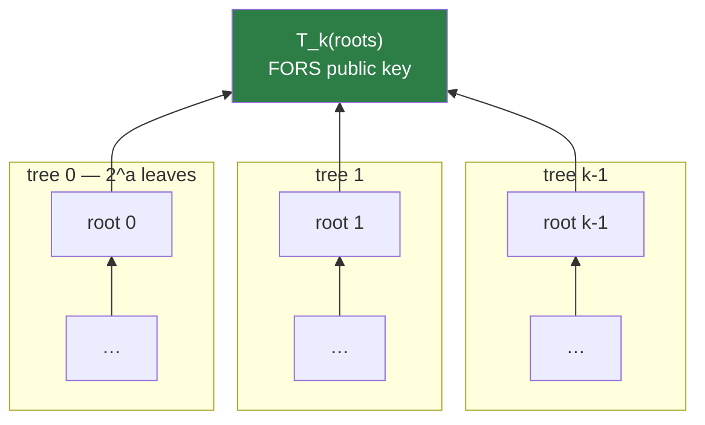

# 6. FORS

!!! abstract "Where we are"

    **Left over from [chapter 5](statefulness.md):** the leaf index comes from
    the message, so two messages will sometimes land on the same key. A one-time
    signature there is fatal.
    **Goal:** a signature scheme that survives being used a few times.

## Forest Of Random Subsets

FORS is a **few-time signature**. The name describes the construction exactly:
a *forest* of `k` Merkle trees, and signing reveals a pseudorandom *subset* of
their leaves — one per tree, chosen by the message.

Each of the `k` trees has `2^a` leaves. Every leaf is a secret value derived
from `SK.seed` and its address; each tree's root is a Merkle root over its
leaves; the FORS public key compresses all `k` roots into one `n`-byte value.



## Signing

The `md` field from the message digest is split into **`k` indices of `a` bits
each**. Index `i` says which leaf to open in tree `i`.

For each tree, the signature carries two things:

1. the **secret leaf value** at that index, and
2. the **authentication path** — `a` sibling nodes proving it belongs to that
   tree.

```
FORS signature = k × ( 1 secret + a auth nodes ) × n bytes
               = k × (a + 1) × n
```

For SLH-DSA-128s (`k = 14`, `a = 12`, `n = 16`): 14 × 13 × 16 = **2,912 bytes**.
That is 37% of the entire 7,856-byte signature — FORS is the single largest
component.

Verification reverses it: for each tree, hash the revealed secret to a leaf, fold
in the auth path to get a candidate root, then compress all `k` candidate roots
and compare against the expected FORS public key.

!!! note "Verification returns rather than compares"

    As with WOTS+ and XMSS, `fors_pkFromSig` **reconstructs** the public key and
    hands it back. The top-level scheme does not compare it against anything
    stored — it feeds it to the hypertree as the message to be certified. See
    [chapter 8](assembly.md).

## Why reuse is survivable

Here is the crucial difference from a one-time scheme.

Signing reveals exactly `k` secrets out of `k · 2^a` total — one per tree.
Signing a *second* message reveals `k` more, at independently chosen indices. In
each tree, the second index usually differs from the first, so a different secret
opens. Nothing is compounded.

For an attacker to forge a signature on a target message, they need the secret at
**every one of the `k` indices** that the target's digest selects. They can only
use secrets already revealed. So the forgery succeeds only if, for all `k` trees
simultaneously, the target's index happens to coincide with one they have already
seen.

After `q` signatures, each tree has at most `q` of its `2^a` leaves exposed, so
the chance of a hit in one tree is about `q / 2^a`, and all `k` must hit:

```
P(forgery) ≈ ( q / 2^a )^k
```

The `k`-th power is what makes this work. Plugging in SLH-DSA-128s
(`a = 12`, `k = 14`) with NIST's `q = 2^64` budget:

```
q / 2^a  =  2^64 / 2^12  =  2^52          … looks alarming on its own
```

That ratio exceeds one because `q` far exceeds the leaf count, so the simple
bound above is not the one that applies at this scale — the real analysis also
credits the `2^h` different FORS *keypairs* the hypertree provides, since an
attacker's `2^64` signatures are spread across `2^63` distinct FORS instances
rather than hammering one. The two effects together are what FIPS 205's
parameters balance.

The takeaway is structural rather than arithmetic:

!!! success "Graceful degradation"

    A one-time signature used twice gives forgery probability ≈ 1. FORS used
    `q` times gives a probability that falls off as the **`k`-th power** of the
    per-tree exposure rate. That is the difference between a cliff and a slope,
    and it is the only reason a stateless scheme is possible.

## Reading `k` and `a` as a design knob

`k` and `a` trade signature size against security, and the two hash families make
the same trade at both ends:

| Parameter set | `k` | `a` | FORS leaves (`k·2^a`) | FORS sig bytes |
|---|---|---|---|---|
| 128s | 14 | 12 | 57,344 | 2,912 |
| 128f | 33 | 6 | 2,112 | 3,696 |
| 256s | 22 | 14 | 360,448 | 10,560 |
| 256f | 35 | 9 | 17,920 | 11,520 |

The `s` sets use **fewer, taller** trees; the `f` sets use **more, shorter** ones.
Taller trees mean more leaves per tree, so a lower per-tree exposure rate, so
fewer trees are needed for the same security — hence a smaller signature. But
taller trees cost more to build, since signing must compute `k` full Merkle
roots. That is one of the two mechanisms behind the `s`/`f` split; the other is
in [chapter 7](hypertree.md).

## Three algorithms plus key derivation

FIPS 205 §8, implemented in [`src/fors.zig`](../components/fors.md):

| Algorithm | Section | Purpose |
|---|---|---|
| `fors_skGen` | §8.1, Alg 14 | Derive leaf secret `idx` via `PRF(SK.seed, PK.seed, ADRS)` |
| `fors_node` | §8.2, Alg 15 | Node at height `z`, index `i` — recursive, like `xmss_node` |
| `fors_sign` | §8.3, Alg 16 | Reveal `k` secrets + `k` auth paths |
| `fors_pkFromSig` | §8.4, Alg 17 | Reconstruct the FORS public key |

`fors_node`'s recursion mirrors `xmss_node`, with one difference worth noting:
its leaves are **raw derived secrets hashed once**, not compressed WOTS+ public
keys. FORS has no WOTS+ in it at all — it is a forest of plain Merkle trees over
PRF output. That makes FORS considerably cheaper per leaf than an XMSS tree of
the same height.

!!! warning "FORS handles secret material directly"

    `fors_skGen` and `fors_node` touch `SK.seed`-derived secrets, which makes
    them the primary target of this library's
    [constant-time verification](../implementation/constant-time.md). The
    ctgrind harness taints `SK.seed` and runs `fors_node` under Valgrind
    specifically because this is where secrets flow.

## What FORS does not solve

A FORS public key is `n` bytes, and there is one per hypertree leaf — `2^h` of
them. The verifier holds a single root, so **the FORS public key still needs
certifying**. That is what the hypertree is for.

And we are back to the wall from
[chapter 3](merkle-trees.md#the-cost-that-will-bite): certifying `2^63` FORS
keys means a tree of height 63, whose root nobody can compute.

!!! success "Chapter 6 outcome"

    FORS signs `md` by revealing one leaf from each of `k` trees of height `a`.
    Forgery probability falls as the `k`-th power of per-tree exposure, so reuse
    degrades gracefully instead of catastrophically — which is what makes
    statelessness viable.

    Remaining: certify `2^h` FORS public keys under one root, without building a
    height-63 tree.

[Chapter 7: The hypertree →](hypertree.md){ .md-button .md-button--primary }
