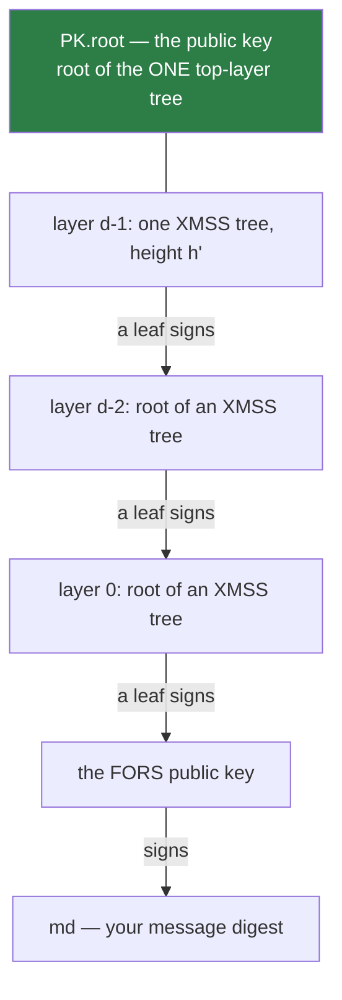

# 7. The hypertree

!!! abstract "Where we are"

    **Left over from [chapter 6](fors.md):** `2^h` FORS public keys need
    certifying under a single root, but computing the root of a height-63 tree
    requires visiting `2^63` leaves.
    **Goal:** the same commitment, computable this century.

## Why one tall tree is impossible

From [chapter 3](merkle-trees.md#the-cost-that-will-bite): a Merkle root
requires every leaf. Height 63 means `2^63 ≈ 9.2 × 10^18` leaves, each a full
WOTS+ key generation of ~500 hash invocations.

That is on the order of `10^21` hash invocations for a single key generation. At
a billion hashes per second it finishes in roughly 300,000 years. Key generation
must take milliseconds.

## Certification chains

The insight: a Merkle tree is not the only way to bind one key to another. **A
signature is also a binding.** And we already have a signature scheme — XMSS.

So instead of one tree of height 63, stack `d` trees of height `h' = h/d`. Each
tree's leaves sign the *roots of the trees below*.

For SLH-DSA-128s: `h = 63`, `d = 7`, `h' = 9`. Seven layers of height-9 trees.



Trust flows down the chain: the verifier trusts `PK.root`; the top tree's leaf
vouches for a layer-`d-2` root; that root's leaf vouches for the next; the
layer-0 leaf vouches for the FORS public key; FORS vouches for the message.

Each link is a real XMSS signature — a WOTS+ signature plus an `h'`-node
authentication path.

## The cost collapse

Key generation now needs only the **top layer's single tree**:

```
2^h'  leaves  instead of  2^h
2^9 = 512     instead of  2^63
```

The lower layers are never built at key-generation time. They do not need to be:
they are *derived* from `SK.seed` on demand, and any particular lower tree is
only ever built when a signature actually needs it.

Signing builds one tree per layer — the specific tree on the path from the chosen
leaf to the root:

```
signing cost  ≈  d × 2^h'     instead of  2^h
              =  7 × 512 = 3,584 leaves    instead of  9.2 × 10^18
```

Exponential to linear-in-`d`. That is the whole trick.

| Approach | Keygen leaves | Signing leaves |
|---|---|---|
| One tree, `h = 63` | 2^63 (infeasible) | 2^63 |
| 7 trees, `h' = 9` | **512** | **3,584** |

## Index arithmetic

`idx_tree` and `idx_leaf` come out of the message digest
([chapter 5](statefulness.md#how-the-index-is-really-chosen)). Together they name
a leaf in the bottom layer. Climbing a layer consumes `h'` bits:

```
at each layer:
    sign with leaf  idx_leaf  of tree  idx_tree
    then:
        idx_leaf =  idx_tree & (2^h' - 1)      # low h' bits pick the leaf above
        idx_tree =  idx_tree >> h'             # the rest picks that tree
```

After `d` layers `idx_tree` is zero — there is exactly one tree at the top, and
its root is `PK.root`. That `idx_tree` reaches zero after exactly `d` shifts is
the structural reason `h = h' · d` must hold, a relation this library
[checks at compile time](../implementation/comptime.md).

## Verification

Verification does not need `PK.root` until the very end. Each layer's
`xmss_pkFromSig` **returns** a root ([chapter 4](xmss.md)), and that root becomes
the message verified at the next layer up:

```
node = FORS public key                       # reconstructed from the signature
for layer in 0 .. d-1:
    node = xmss_pkFromSig(layer's signature, node, idx_leaf, idx_tree)
    shift the indices as above

return node == PK.root                       # the single comparison
```

One comparison, at the top. Every layer below is a pure reconstruction. This is
why `pkFromSig` returns a value instead of a boolean — the composability is the
design.

## The `s`/`f` split, finally explained

`h` is fixed by the security target (roughly, `2^64` signatures need `h ≈ 64`).
But `d` is free, and `h' = h/d`, so choosing `d` trades signing speed against
signature size.

| | `d` | `h'` | Signing cost `∝ d·2^h'` | Signature `∝ (h + d·len)·n` |
|---|---|---|---|---|
| **128s** ("small") | 7 | 9 | 7 × 512 = 3,584 | 7,856 B |
| **128f** ("fast") | 22 | 3 | 22 × 8 = **176** | **17,088 B** |

- **Many shallow layers (`f`)** — each tree is tiny and cheap to build, so
  signing is ~20× faster. But every layer contributes a whole WOTS+ signature
  (`len × n` ≈ 560 bytes), and 22 layers of that dominates the signature size.
- **Few deep layers (`s`)** — only 7 WOTS+ signatures to carry, so the signature
  is 2.2× smaller. But each tree has 512 leaves rather than 8, so signing is much
  more expensive.

Measured on this project's benchmarks (Apple M3 Pro, `ReleaseFast`), SHAKE-128s
signing runs around 368 ms against 128f's 19 ms — a factor of ~20, in exchange
for 2.2× less signature. The two variants are not "one is better"; they are two
positions on a genuine curve.

!!! tip "How to choose"

    Signature travels over a constrained link, or is stored per-record, and
    signing is rare → **`s`**. Signing happens often, or latency matters, and the
    bytes are affordable → **`f`**. Both give the same security level.

## Two algorithms

FIPS 205 §7, implemented in [`src/hypertree.zig`](../components/hypertree.md):

| Algorithm | Section | Purpose |
|---|---|---|
| `ht_sign` | §7.1, Alg 12 | `d` XMSS signatures up the chain |
| `ht_verify` | §7.2, Alg 13 | Fold `d` reconstructions, compare to `PK.root` |

`HT_SIG` is `d` XMSS signatures — `d × (len·n + h'·n)` = `(h + d·len)·n` bytes,
the largest term in the total.

!!! success "Chapter 7 outcome"

    Stacking `d` XMSS trees of height `h'` replaces one height-`h` tree, turning
    exponential key generation into `2^h'` and signing into `d · 2^h'`. Choosing
    `d` is exactly the `s`/`f` trade.

    **Nothing is left broken.** Every piece is now in place.

[Chapter 8: Putting it together →](assembly.md){ .md-button .md-button--primary }
