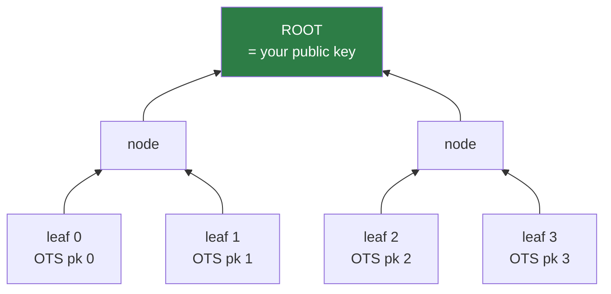
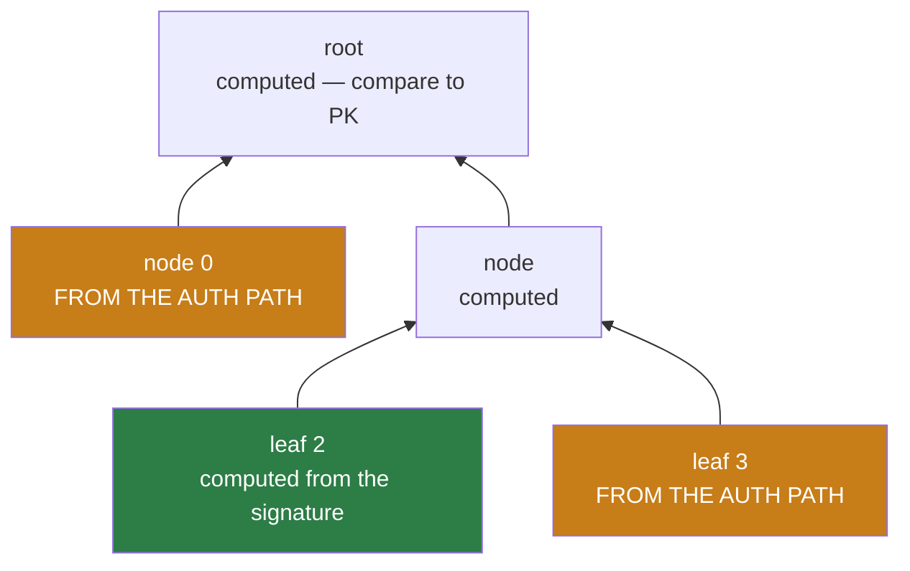

# 3. Merkle trees

!!! abstract "Where we are"

    **Left over from [chapter 2](wots.md):** WOTS+ signs once per key. Signing
    `N` messages needs `N` keys and therefore `N` public keys distributed in
    advance.
    **Goal:** one small public key that certifies many one-time keys.

## Hashing many things into one

Take `2^h'` one-time public keys. Hash each into a leaf. Hash each adjacent pair
into a parent. Repeat until one value remains: the **root**.



That single `n`-byte root is now your entire public key, and it commits to all
`2^h'` one-time keys at once. Changing any leaf changes the root — that is
second-preimage resistance doing the work.

For `h' = 9`: one 16-byte root standing in for 512 one-time keys.

## Proving a leaf belongs

The verifier holds only the root, so a signature must prove *this particular
one-time key is in the committed tree*. The proof is the **authentication
path**: the sibling node at each level on the way up.

Signing with leaf 2 in a 4-leaf tree, the verifier can compute leaf 2 itself
(from `wots_pkFromSig`), but needs leaf 3 to get their common parent, and needs
node 0 to get the root.



So a full signature carries:

1. the WOTS+ signature,
2. the leaf index,
3. the authentication path — `h'` sibling nodes.

Verification: reconstruct the WOTS+ public key, hash it to a leaf, fold in each
auth-path sibling in turn, and compare the resulting root against the public
key. Match means the one-time key was genuinely in the tree *and* the WOTS+
signature was valid.

Cost: `h'` extra `n`-byte values, and `h'` extra hashes. **Logarithmic** in the
number of leaves — 9 nodes to select among 512 keys, 20 to select among a
million.

!!! info "Left or right?"

    Folding the auth path requires knowing whether each sibling is the left or
    right child. That comes from the bits of the leaf index — bit `z` says which
    side you are on at height `z`. This is why the index must be part of the
    signature, and why index handling is a classic source of subtle bugs: get a
    bit backwards and you compute a wrong root that is still *internally*
    consistent.

## Where do the leaves come from?

`2^h'` one-time keys means `2^h' × len` secret values. For `h' = 9`, `len = 35`,
`n = 16`: 512 × 35 × 16 = 286,720 bytes of secret material. For a tall tree it
is worse — astronomically so.

Nobody stores that. Every secret is **derived on demand**:

```
sk_for_this_chain = PRF(SK.seed, ADRS)
```

`SK.seed` is a single `n`-byte value in the private key. `ADRS` says which leaf,
which chain. The secret exists only while it is being used, and is regenerated —
identically — whenever it is needed again.

!!! tip "The trade this makes"

    A 64-byte private key stands in for a structure with billions of secrets.
    The cost is that **signing must rebuild the tree**: producing an
    authentication path means computing sibling subtrees from scratch, which
    means regenerating every WOTS+ key underneath them. This single decision is
    the dominant term in SLH-DSA's signing cost, and it is why the `s`/`f`
    parameter split ([chapter 7](hypertree.md)) exists at all.

## The cost that will bite

Key generation must compute the root, which requires **every leaf**, which
requires every one-time key in the tree.

| `h'` | Leaves | WOTS+ keygens for one root |
|---|---|---|
| 9 | 512 | 512 |
| 20 | ~1 million | ~1 million |
| 40 | ~10¹² | ~10¹² |
| 63 | ~9 × 10¹⁸ | **infeasible** |

Tree height is exactly the number of signatures the key can produce, so a
long-lived key wants to be tall. But cost doubles with every extra level, and
somewhere around height 25 key generation stops being something you are willing
to wait for.

Remember this table. [Chapter 7](hypertree.md) is entirely about defeating it.

!!! success "Chapter 3 outcome"

    A Merkle tree compresses `2^h'` one-time public keys into one `n`-byte root,
    with logarithmic-size membership proofs. Secrets are derived from a seed
    rather than stored.

    Two problems remain: hashing needs to be **position-aware** to survive the
    multi-target attack of [chapter 2](wots.md) at tree scale, and key
    generation cost is exponential in height.

[Chapter 4: XMSS →](xmss.md){ .md-button .md-button--primary }
