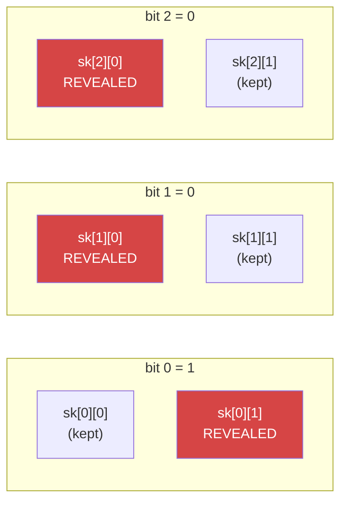

# 1. One-time signatures

!!! abstract "Where we are"

    **Goal:** sign a message using nothing but a hash function.
    **Tool available:** a hash function.
    **Constraint:** no number theory allowed — that is the whole point.

## The trick: a hash is a one-way door

A hash function `H` is easy to compute forwards and infeasible to invert. That
asymmetry is the only raw material we have, and remarkably, it is enough.

Publish `y = H(x)` while keeping `x` secret. Later, reveal `x`. Anyone can check
`H(x) == y`, and nobody could have produced `x` without being told it. You have
just proved you knew a secret, using only a hash.

That is a signature on a single bit of information: *"I am the one who knew
`x`."* Everything that follows is engineering to turn that into a signature on
an arbitrary message.

## Lamport's construction

Leslie Lamport's 1979 scheme does it directly. To sign an `m`-bit message
digest, generate **two** secrets per bit position:

```
Private key:  sk[0][0], sk[0][1]      ← for message bit 0
              sk[1][0], sk[1][1]      ← for message bit 1
              ...
              sk[m-1][0], sk[m-1][1]

Public key:   H(sk[0][0]), H(sk[0][1])
              H(sk[1][0]), H(sk[1][1])
              ...
```

Think of it as a row of pairs of locked boxes. Each pair has a "0" box and a
"1" box, and the public key is the set of all their lids.

**To sign:** walk the message bit by bit and open the box matching each bit.
Reveal `sk[i][ m_i ]` for every position `i`.



**To verify:** hash each revealed value and check it against the corresponding
public-key entry for the bit the message claims. All `m` must match.

**Why it works:** to forge a signature on a different digest, an attacker needs
at least one secret from a box that was never opened — and finding it means
inverting `H`.

## Why "one-time" is not a naming quirk

Sign one message and you reveal one secret per position — one box per pair. The
unopened box in each pair is what still protects you.

Sign a *second*, different message with the same key and the pairs start to open
completely. Wherever the two digests differ, both boxes are now open. An
attacker who has seen both signatures can **mix and match**: for every position
where the messages disagreed, they hold both secrets and can claim either bit.

Two signatures on digests differing in `t` positions let an attacker forge any
of `2^t` digests for free — including, with high probability, one that hashes
from a message they chose.

!!! danger "The failure is total, not gradual"

    This is the property that makes hash-based signatures operationally
    dangerous, and it echoes all the way up through
    [chapter 5](statefulness.md). Reusing a one-time key does not shave bits off
    your security margin. It hands over the ability to forge. Everything SLH-DSA
    does to avoid reuse — and to survive it when it happens — traces back to
    this paragraph.

## The other problem: size

Lamport is correct, simple, and enormous. For `n = 16` (128-bit security) and a
256-bit digest:

```
Private key:  2 × 256 × 16 B  =  8,192 B
Public key:   2 × 256 × 16 B  =  8,192 B
Signature:        256 × 16 B  =  4,096 B
```

Four kilobytes to sign one message, once. And that is before certifying the
public key, which we will need to do in [chapter 3](merkle-trees.md).

The waste is glaring: we generate two secrets per bit and use exactly one. Half
the key material is pure overhead, existing only so the verifier knows the
*unrevealed* half was possible.

Can we extract more than one bit of message from each secret?

!!! success "Chapter 1 outcome"

    A hash function alone gives a working signature scheme. Two problems:
    it is roughly 4 KB per signature, and the key **must never be used twice**.

    Chapter 2 attacks the size. The one-time restriction survives until
    [chapter 6](fors.md).

[Chapter 2: Winternitz and WOTS+ →](wots.md){ .md-button .md-button--primary }
