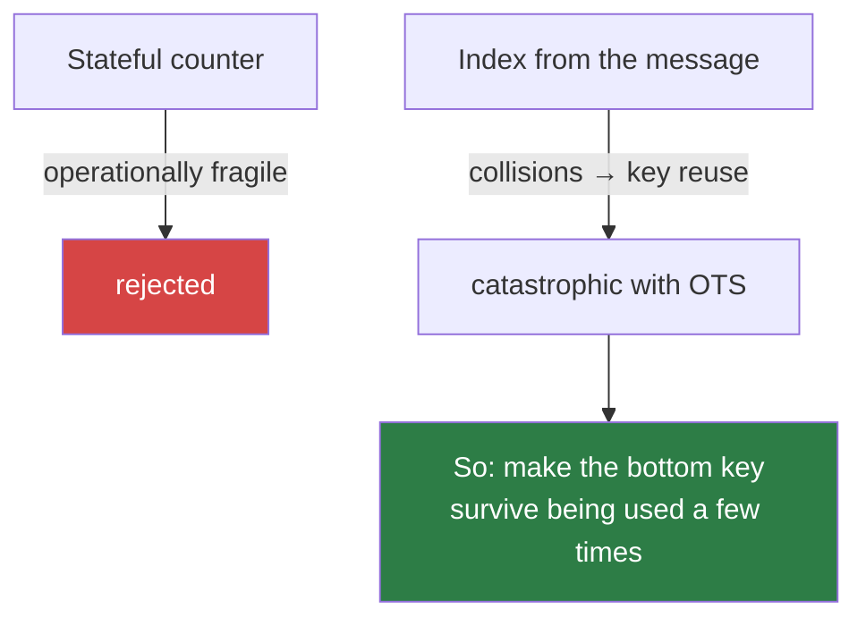

# 5. The statefulness problem

!!! abstract "Where we are"

    **Left over from [chapter 4](xmss.md):** each XMSS leaf is a one-time key.
    The signer must remember which leaves are spent and never reuse one.
    **Goal:** eliminate that requirement.

This is the pivotal chapter. Everything distinctive about SLH-DSA — the `SL` in
its name, the FORS construction, the hypertree's dimensions — follows from the
decision made here.

## Why a counter is not a solution

The obvious answer is a counter: store the next unused leaf index, increment
after each signature. Cryptographically sound. Operationally, a trap.

The counter has to be correct **across every failure mode of every system the
key ever runs on**:

- **Backups.** Restore a snapshot from last week and the counter goes backwards.
  Every index between then and now gets reused. This is not an exotic failure —
  it is what backups are *for*.
- **Virtual machines.** Snapshot, revert, resume. Same problem, plus VM
  snapshots are taken automatically by infrastructure nobody told about the
  counter.
- **Replication.** Two service instances behind a load balancer, both holding
  the key, each with its own counter. They immediately collide.
- **Container images.** Bake the key into an image, deploy it to fifty pods. All
  fifty start at the same index.
- **Crashes.** Sign, then crash before the counter is durably flushed. On
  restart, reuse.
- **Migration.** Copy the key to new hardware. Did the counter come with it? Is
  the old machine definitely off?

Each has a fix. The fixes are things like "flush the counter to durable storage
before releasing the signature, and never restore this file from backup, and
never run two of these" — constraints that must hold for the entire operational
lifetime, enforced by discipline rather than by mathematics.

!!! danger "And the failure is silent"

    Reuse a one-time key and nothing breaks. Signatures still verify. Tests
    still pass. Monitoring stays green. The only observable consequence is that
    an attacker who collected two signatures from the same leaf can now forge —
    and you will not learn that until they do.

    Compare a nonce-reuse bug in ECDSA: same class of catastrophe, same silence.
    The industry's experience with that class is not encouraging.

## The stateless idea

What if the leaf index were not counted, but **computed from the message**?

```
idx = H(message)      # roughly
```

No counter. No file to flush, no state to restore incorrectly, no coordination
between replicas. Sign the same message twice and you use the same leaf twice —
which is harmless, because both signatures are identical. Backups become
irrelevant. Replication becomes free.

This is the trick that makes SLH-DSA stateless, and stated that plainly it
sounds too easy. It is not, because of what it does to reuse.

## Collisions are now unavoidable

With `2^h` leaves and pseudorandom selection, distinct messages **will**
occasionally select the same leaf. Birthday bound: after roughly `2^(h/2)`
signatures a collision is likely, and even before that, every individual pair
has probability `2^-h`.

Two different messages on one leaf is precisely the one-time-key reuse from
[chapter 1](one-time-signatures.md) — the catastrophic case.

Making `h` enormous does not rescue this. NIST's target is up to `2^64`
signatures per key, so we would need `h` large enough that collisions among
`2^64` messages stay negligible: `h ≥ 128` or so, and
[chapter 3's table](merkle-trees.md#the-cost-that-will-bite) already showed that
height 63 is infeasible. That road is closed.



## The actual resolution

If collisions cannot be prevented, they must be **survived**. Replace the
one-time signature at the bottom with something that degrades gracefully:

> a **few-time signature** — secure for a handful of uses, with forgery
> probability that rises smoothly rather than hitting certainty at use two.

Then a collision is not a break. It is a small, quantifiable erosion of the
security margin, and the parameters can be chosen so that even at `2^64`
signatures the total forgery probability stays below the target level.

That few-time scheme is **FORS**, and it is [chapter 6](fors.md).

## How the index is really chosen

One refinement, because "`idx = H(message)`" would be a genuine weakness. If the
index were a public function of the message alone, an attacker could **search**
for messages landing on a leaf they had already seen signed — deliberately
manufacturing the collisions that FORS is only designed to absorb by accident.

So the derivation is keyed by a secret and randomised:

```
R      = PRF_msg(SK.prf, opt_rand, M)          # the randomiser, in the signature
digest = H_msg(R, PK.seed, PK.root, M)         # m bytes
         └─ md ─┘└─ idx_tree ─┘└─ idx_leaf ─┘
```

Three properties fall out:

- **`SK.prf` is secret**, so an attacker cannot predict which leaf a message
  will use, and cannot search for collisions offline.
- **`R` is in the signature**, so the verifier can recompute the same digest and
  reach the same indices.
- **`opt_rand` is optional.** Supply fresh randomness for *hedged* signing (the
  recommendation); pass `null` and the implementation substitutes `PK.seed`,
  giving fully deterministic signatures. Deterministic signing is valuable for
  reproducible builds and for testing against fixed vectors — and unlike ECDSA,
  determinism here is safe rather than mandatory-with-a-catastrophic-failure-mode.

The single `H_msg` output is then sliced three ways: `md` is the message for
FORS, `idx_tree` picks which hypertree tree, `idx_leaf` picks which leaf inside
it. See [the top-level scheme](../components/scheme.md#digest-parsing) for the
exact byte arithmetic.

!!! success "Chapter 5 outcome"

    Statefulness is traded away: the leaf is chosen pseudorandomly from a keyed
    hash of the message rather than from a counter. No persistent state, so
    backups and replicas are harmless.

    The cost is that key reuse is now inevitable rather than forbidden — which
    demands a signature scheme that survives a few uses.

[Chapter 6: FORS →](fors.md){ .md-button .md-button--primary }
