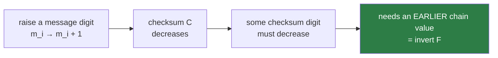

# 2. Winternitz and WOTS+

!!! abstract "Where we are"

    **Left over from [chapter 1](one-time-signatures.md):** Lamport works but
    costs ~4 KB per signature, spending two secrets per message bit to convey
    one.
    **Goal:** convey more per secret.

## Hash chains: counting with a one-way function

Lamport uses each secret once — revealed or not. But a hash can be applied
repeatedly, and *how many times* is itself information.

Take a secret `sk` and build a chain:

```
sk ──F──▶ F(sk) ──F──▶ F²(sk) ──F──▶ ... ──F──▶ F^(w-1)(sk)
 │                                                    │
 └── secret                                    public ┘
```

Publish the end of the chain, `pk = F^(w-1)(sk)`. Now revealing an
**intermediate** value encodes a number: hand over `F^v(sk)` and you have
communicated `v`.

The verifier does not need to know `v` in advance. Given a claimed value and a
claimed digit `v`, they apply `F` the remaining `w - 1 - v` times and check they
land on `pk`. Walking *forward* is easy; that is the direction verification goes.

With `w = 16`, one chain carries a base-16 digit — **four message bits per
secret** instead of Lamport's half-bit-per-secret. An eightfold improvement.

This is Winternitz's idea, and `w` is the Winternitz parameter: the knob trading
signature size against hashing work. Larger `w` means fewer chains (smaller
signature) but longer chains (more computation). FIPS 205 fixes `lg_w = 4`, so
`w = 16`, for all twelve parameter sets.

## The forgery that breaks naive Winternitz

There is a serious problem, and it comes from the direction the chain runs.

An attacker who receives `F^v(sk)` — a signature on digit `v` — can compute
`F^(v+1)(sk)` themselves. They just apply `F`. **Any digit can be increased for
free.**

Given a signature on digest `3, 7, 2, ...` an attacker can produce a valid
signature on `4, 7, 2, ...` or `9, 12, 5, ...` — any digest that is
component-wise greater than or equal to the original. Find a message whose
digest dominates the signed one and the forgery is complete. That is not a
theoretical weakness; it is trivially exploitable.

## The checksum

The fix: make it impossible to increase every digit at once. Append a
**checksum** whose digits move the *opposite* way.

```
C = Σ (w - 1 - m_i)     over all message digits m_i
```

Each term is "how far this digit is from the maximum". Encode `C` itself in
base `w` and sign those digits with their own chains.

Now consider the attacker. Raising any message digit `m_i` **decreases** `C`,
which decreases at least one checksum digit. To keep the signature valid they
must produce a chain value *earlier* than the one they hold — inverting `F`.
The forgery requires exactly what the hash function forbids.



The two halves are named in FIPS 205:

- **`len_1`** — chains for the message digits. `len_1 = ceil(8n / lg_w)`, which
  is `2n` when `lg_w = 4`.
- **`len_2`** — chains for the checksum digits.
- **`len = len_1 + len_2`** — total chains in one WOTS+ key.

For `n = 16`: `len_1 = 32`, `len_2 = 3`, `len = 35`.

!!! note "`gen_len2` and the off-by-one trap"

    The final FIPS 205 computes `len_2` with an algorithm called `gen_len2`,
    inserted as **Algorithm 1 in §3.2** — and it was *not* in the initial public
    draft. Its insertion shifted every subsequent algorithm number up by one and
    renumbered the WOTS+ subsections. Any algorithm number you find in a
    draft-era paper, blog post or older codebase is very likely one too low.
    Check the final PDF. This repository tracks the discrepancy in issue #16.

## The size win

| Scheme | Signature (n=16, 256-bit digest) |
|---|---|
| Lamport | 4,096 B |
| WOTS+ (`w = 16`) | 35 × 16 = **560 B** |

A 7.3× reduction, from one idea. And the chain count grows only logarithmically
in `w`, which is why nobody bothers with `w = 4`.

## What the "+" adds

**WOTS+** is Winternitz plus a specific hardening, and it addresses
**multi-target attacks**.

The plain scheme has a scaling weakness. SLH-DSA contains an astronomical number
of WOTS+ instances — a hypertree with `h = 66` has `2^66` leaves, each a
separate one-time key. If all of them chain with the same unkeyed `F`, an
attacker is not obliged to attack a *chosen* one. They can attack **all of them
at once**: compute one giant table and hope for a hit anywhere in the structure.
With `2^66` targets, the effective security drops by up to 66 bits. A 128-bit
scheme delivering 62 bits is not a 128-bit scheme.

The defence is to make every chain step **unique to its position**. WOTS+ mixes
in a per-step tweak, so the function applied at step 3 of chain 17 of leaf
0x4A9F… differs from the function applied anywhere else. In FIPS 205 the tweak
comes from two things:

- **`PK.seed`** — a public, per-keypair value, so the whole structure of one
  keypair is unrelated to any other keypair's.
- **`ADRS`** — the [address](../components/adrs.md) encoding exactly where this
  hash sits: which layer, which tree, which leaf, which chain, which step.

Precomputation no longer amortises. Each target must be attacked separately, and
the multi-target advantage collapses.

!!! tip "Tweakable hashing is the real workhorse"

    This pattern — never hash naked data, always hash it together with an
    address saying where you are — recurs at *every* level of SLH-DSA. It is why
    [ADRS](../components/adrs.md) threads through every function signature in
    the codebase, and why a bug in address handling produces a scheme that
    passes casual round-trip tests while being catastrophically weaker than
    advertised.

## The four operations

FIPS 205 §5 defines WOTS+ as four algorithms, implemented in
[`src/wots.zig`](../components/wots.md):

| Algorithm | Section | Purpose |
|---|---|---|
| `chain` | §5, Alg 5 | Walk a chain `s` steps from index `i` |
| `wots_pkGen` | §5.1, Alg 6 | Derive the public key: run all `len` chains to the end |
| `wots_sign` | §5.2, Alg 7 | Reveal `F^(m_i)(sk_i)` per digit |
| `wots_pkFromSig` | §5.3, Alg 8 | **Recover** the public key from a signature |

`wots_pkFromSig` deserves attention: verification does not compare a signature
against a stored public key. It **reconstructs** the public key from the
signature and the message, and the caller checks whether the result is the
expected one. That inversion is what lets WOTS+ nest inside Merkle trees — the
reconstructed public key becomes a leaf, and the leaf feeds a root computation.
[Chapter 3](merkle-trees.md) uses this immediately.

!!! success "Chapter 2 outcome"

    WOTS+ signs in 560 bytes instead of 4,096, and resists multi-target attacks
    by tweaking every hash with its own address.

    **Still one-time.** And we now have a new problem: a WOTS+ public key is
    `len × n` = 560 bytes, and we need a *fresh key per message*. Distributing a
    new 560-byte public key for every signature defeats the purpose of having a
    public key.

[Chapter 3: Merkle trees →](merkle-trees.md){ .md-button .md-button--primary }
