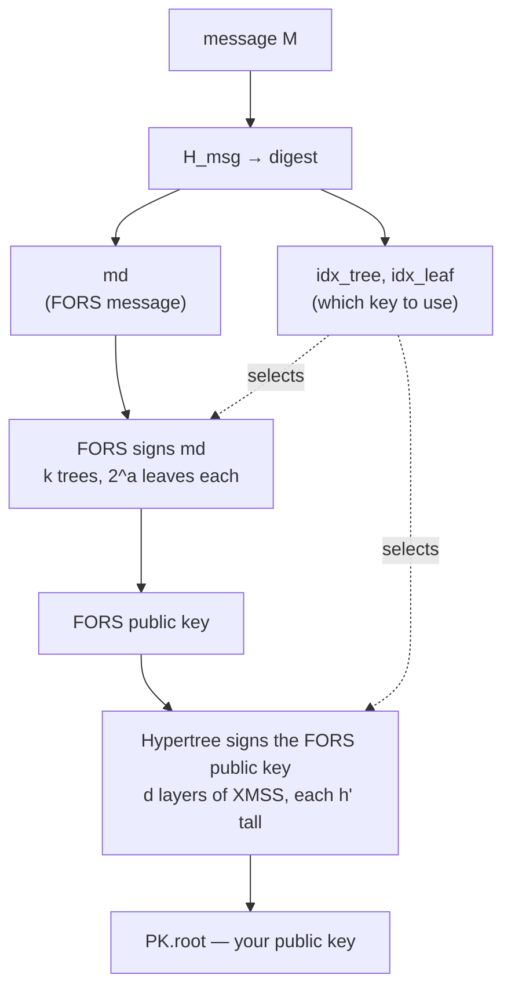

# slh-dsa-zig

A pure-Zig implementation of **SLH-DSA**, the stateless hash-based digital
signature standard published as [FIPS 205][fips205] in August 2024.

!!! danger "Experimental — do not use in production"

    This library has not been audited. It passes the NIST ACVP known-answer
    tests for all twelve parameter sets, but KATs prove *correctness against
    the spec*, not *safety against an attacker*. Treat it as a study
    implementation and a preview, not as something to protect real data with.
    See [SECURITY.md][security] for the threat model.

## What this site is for

The repository already documents how the code is **organised**
([ARCHITECTURE.md][arch]) and what state it is **in** ([README][readme],
[MILESTONES.md][milestones]). This site documents something different: **how
SLH-DSA works, and why it is shaped the way it is.**

FIPS 205 is a specification. It is precise, complete, and almost entirely
silent on motivation — it tells you what to compute, never why that
computation is the right one. Read it cold and WOTS+ chains, FORS forests and
the hypertree all look like arbitrary complexity. They are not. Each one is a
forced move, the cheapest available answer to a specific problem created by
the previous design decision.

This site reconstructs that chain of reasoning.

## How to read it

<div class="grid cards" markdown>

-   :material-help-circle:{ .lg .middle } **[Why](why/index.md)**

    ---

    Why classical signatures are on a clock, and why hash-based signatures —
    an idea from 1979 — turned out to be the conservative answer.

-   :material-stairs:{ .lg .middle } **[How it works](concepts/index.md)**

    ---

    The main event. Eight chapters that build SLH-DSA from a one-time
    signature, each solving the problem the last one created. Start here if
    you want to *understand* the scheme.

-   :material-code-braces:{ .lg .middle } **[Components](components/index.md)**

    ---

    Per-module walkthroughs. Every FIPS 205 algorithm mapped to the function
    in `src/` that implements it. Start here if you want to *read the code*.

-   :material-wrench:{ .lg .middle } **[Implementation](implementation/index.md)**

    ---

    The engineering: comptime parameterisation, constant-time discipline, and
    the four independent test regimes that back the correctness claims.

-   :material-book-alphabet:{ .lg .middle } **[Glossary](glossary.md)**

    ---

    Around sixty terms, from ADRS to WOTS+. Hash-based signatures have an
    unusually dense vocabulary and a lot of near-synonyms; when a word stops
    meaning anything, look here.

-   :material-table:{ .lg .middle } **[Reference](reference/index.md)**

    ---

    All twelve parameter sets with their derived sizes, the complete FIPS 205
    section-to-file map, and where to read further.

</div>

If you are new to the topic, read **Why** then **How it works** in order. The
concept chapters are cumulative — each opens by naming the problem left over
from the one before.

If you already know SPHINCS+ and want the implementation, skip to
[Components](components/index.md).

## The scheme in one page

SLH-DSA signs a message with a **few-time signature** (FORS) whose public key
is then certified by a **hypertree**: a tree of trees of one-time signatures,
rooted at your actual public key.



Three properties fall out of that structure, and they are the whole reason the
scheme is interesting:

**Its security rests only on hash functions.** No factoring, no discrete
logarithms, no lattices. If SHA-2 and SHAKE hold up, SLH-DSA holds up.

**It is stateless.** Earlier hash-based schemes (XMSS, LMS) must remember
which one-time key they last used and never reuse it — a requirement that
breaks the moment anyone restores a backup. SLH-DSA derives that choice
pseudorandomly from the message instead, so there is no state to corrupt.

**It is large and slow.** A SLH-DSA-SHAKE-128s signature is 7,856 bytes
against Ed25519's 64. Signing costs millions of hash invocations. This is the
price of the first two properties, and it is why SLH-DSA is positioned as a
conservative hedge rather than a default.

| Scheme | Public key | Signature | Rests on |
|---|---|---|---|
| Ed25519 | 32 B | 64 B | Elliptic-curve discrete log — **broken by Shor** |
| RSA-2048 | 256 B | 256 B | Integer factoring — **broken by Shor** |
| ML-DSA-44 (FIPS 204) | 1,312 B | 2,420 B | Module lattices |
| **SLH-DSA-128s (FIPS 205)** | **32 B** | **7,856 B** | **Hash functions only** |
| **SLH-DSA-128f (FIPS 205)** | **32 B** | **17,088 B** | **Hash functions only** |

Note the public key: 32 bytes, the smallest in the table. SLH-DSA's cost is
concentrated entirely in signature size and signing time.

## A note on the code

The library is organised as twelve comptime specialisations of a single
generic:

```zig
const slh_dsa = @import("slh_dsa");
const Scheme = slh_dsa.Slh_Dsa(.slh_dsa_shake_128s);

const kp = try Scheme.KeyPair.generate(io);

var sig: Scheme.Signature = undefined;
try Scheme.signWithContext(&sig, message, "my-app-v1", &kp.secret_key, null);
try Scheme.verifyWithContext(&sig, message, "my-app-v1", &kp.public_key);
```

Every buffer size in that snippet — key lengths, signature length, internal
tree and chain dimensions — is known at compile time. See
[comptime parameterisation](implementation/comptime.md) for why that matters
more here than in most libraries.

## Citation discipline

Every cryptographic claim on this site cites **the final FIPS 205 (August
2024)**, never the initial public draft. This matters more than it sounds: the
final standard inserted `gen_len2` as Algorithm 1 in §3.2, which shifted every
subsequent algorithm number up by one and renumbered the WOTS+ subsections.
A section number recalled from a draft-era paper or blog post is very likely
off by one. If you find a citation here that disagrees with the PDF, the PDF
wins — please [open an issue][issues].

[fips205]: https://nvlpubs.nist.gov/nistpubs/FIPS/NIST.FIPS.205.pdf
[arch]: https://github.com/nandanito/slh-dsa-zig/blob/main/ARCHITECTURE.md
[readme]: https://github.com/nandanito/slh-dsa-zig/blob/main/README.md
[milestones]: https://github.com/nandanito/slh-dsa-zig/blob/main/MILESTONES.md
[security]: https://github.com/nandanito/slh-dsa-zig/blob/main/SECURITY.md
[issues]: https://github.com/nandanito/slh-dsa-zig/issues
